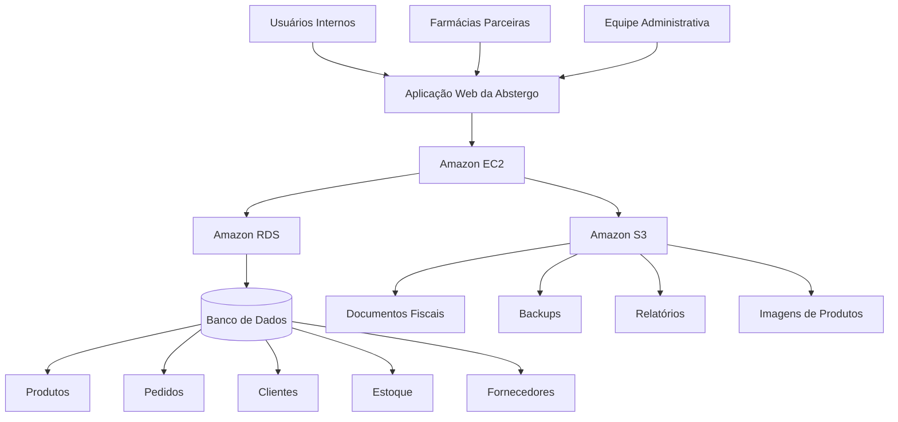
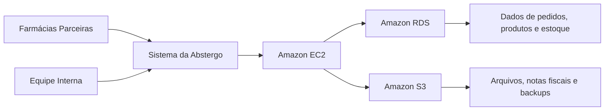
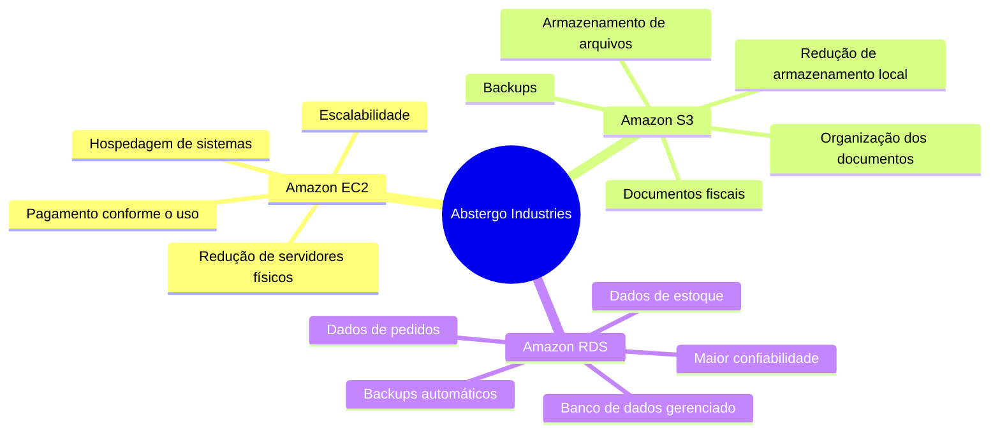

# RELATÓRIO DE IMPLEMENTAÇÃO DE SERVIÇOS AWS

**Data:** 24/05/2026  
**Empresa:** Abstergo Industries  
**Responsável:** Emanuel Cosmo  

---

## Introdução

Este relatório apresenta uma proposta de implementação de serviços em nuvem para a empresa **Abstergo Industries**, uma empresa fictícia do setor farmacêutico que atua como distribuidora de produtos para farmácias, empresas parceiras e outros pontos de venda.

Atualmente, a empresa não possui uma infraestrutura baseada em cloud computing. Com isso, parte da operação pode depender de servidores físicos, armazenamento local, backups manuais e processos que exigem maior esforço de manutenção.

O principal objetivo deste projeto é apresentar **3 serviços da AWS** que possam ajudar a empresa a reduzir custos, melhorar a segurança dos dados, organizar melhor seus arquivos e preparar sua infraestrutura para crescimento futuro.

A proposta foi pensada como uma primeira etapa de modernização da Abstergo Industries, priorizando serviços essenciais para hospedagem de sistemas, armazenamento de documentos e gerenciamento de banco de dados.

---

## Descrição do Projeto

O projeto de implementação foi dividido em **3 etapas**, cada uma focada em uma necessidade importante da empresa.

As ferramentas escolhidas foram:

| Etapa | Serviço AWS | Foco principal |
|---|---|---|
| Etapa 1 | Amazon EC2 | Hospedagem de sistemas e aplicações |
| Etapa 2 | Amazon S3 | Armazenamento de arquivos e backups |
| Etapa 3 | Amazon RDS | Banco de dados gerenciado |

A ideia é criar uma estrutura inicial em nuvem que seja simples, funcional e escalável. Com esses serviços, a Abstergo Industries pode começar sua jornada cloud sem precisar migrar todos os processos de uma só vez.

---

## Etapa 1

### Amazon EC2

- **Nome da ferramenta:** Amazon EC2  
- **Foco da ferramenta:** Hospedagem de servidores virtuais sob demanda  
- **Descrição de caso de uso:**  

O **Amazon EC2** pode ser utilizado pela Abstergo Industries para hospedar os principais sistemas da empresa, como sistema de controle de estoque, painel administrativo, sistema de pedidos e APIs de integração com farmácias parceiras.

Em vez de comprar e manter servidores físicos, a empresa pode utilizar máquinas virtuais na nuvem. Isso ajuda a reduzir custos com equipamentos, manutenção, energia elétrica, refrigeração e suporte físico da infraestrutura.

Na prática, o EC2 permite que a empresa tenha mais flexibilidade. Caso a demanda aumente, a capacidade dos servidores pode ser ampliada. Caso a demanda diminua, os recursos podem ser reduzidos para evitar gastos desnecessários.

### Benefícios para a empresa

- Redução de custos com compra de servidores físicos;
- Menor necessidade de manutenção de hardware;
- Escalabilidade conforme a demanda;
- Possibilidade de hospedar sistemas internos e externos;
- Maior controle sobre a infraestrutura utilizada;
- Pagamento conforme o uso dos recursos.

### Exemplo prático na Abstergo

A Abstergo poderia hospedar no Amazon EC2 um sistema web para controle de pedidos. Nesse sistema, farmácias parceiras poderiam consultar produtos disponíveis, verificar estoque e realizar solicitações de compra.

A equipe interna também poderia acessar um painel administrativo para acompanhar pedidos, atualizar produtos e visualizar informações operacionais.

---

## Etapa 2

### Amazon S3

- **Nome da ferramenta:** Amazon S3  
- **Foco da ferramenta:** Armazenamento de arquivos na nuvem  
- **Descrição de caso de uso:**  

O **Amazon S3** pode ser utilizado para armazenar arquivos importantes da Abstergo Industries, como notas fiscais, comprovantes, contratos, relatórios financeiros, imagens de produtos, documentos regulatórios e backups dos sistemas.

Como a empresa atua no setor farmacêutico, a organização e a segurança dos documentos são pontos importantes. Com o S3, os arquivos podem ser armazenados em buckets, com controle de acesso, políticas de segurança e criptografia.

Outro ponto positivo é a possibilidade de usar diferentes classes de armazenamento. Arquivos acessados com frequência podem ficar em uma classe padrão, enquanto documentos antigos ou pouco acessados podem ser movidos para opções mais econômicas.

### Benefícios para a empresa

- Redução de custos com armazenamento físico;
- Menor risco de perda de arquivos importantes;
- Facilidade para criar rotinas de backup;
- Organização dos documentos por categoria;
- Alta durabilidade dos dados armazenados;
- Controle de acesso aos arquivos;
- Possibilidade de reduzir custos com classes de armazenamento.

### Exemplo prático na Abstergo

A Abstergo poderia criar buckets separados para diferentes tipos de arquivos, como:

- Documentos fiscais;
- Relatórios administrativos;
- Imagens de produtos;
- Contratos;
- Backups dos sistemas.

Dessa forma, os arquivos ficariam centralizados, organizados e acessíveis apenas para usuários autorizados.

---

## Etapa 3

### Amazon RDS

- **Nome da ferramenta:** Amazon RDS  
- **Foco da ferramenta:** Banco de dados gerenciado  
- **Descrição de caso de uso:**  

O **Amazon RDS** pode ser utilizado para armazenar e gerenciar os dados principais da Abstergo Industries. Entre esses dados estão cadastros de produtos, fornecedores, farmácias parceiras, clientes, pedidos, estoque e registros financeiros.

Com o RDS, a empresa não precisa administrar manualmente toda a infraestrutura do banco de dados. A AWS oferece recursos como backups automáticos, atualizações, monitoramento e recuperação em caso de falhas.

Isso reduz o trabalho operacional da equipe técnica e aumenta a confiabilidade do sistema, principalmente em uma empresa que depende de informações atualizadas sobre estoque, pedidos e distribuição.

### Benefícios para a empresa

- Redução de esforço na administração do banco de dados;
- Backups automáticos;
- Maior segurança das informações;
- Melhor disponibilidade dos dados;
- Facilidade para escalar conforme o crescimento da empresa;
- Menor risco de perda de informações críticas;
- Melhor organização dos dados operacionais.

### Exemplo prático na Abstergo

A empresa poderia utilizar o Amazon RDS com MySQL ou PostgreSQL para armazenar as informações do sistema de pedidos e estoque.

Sempre que uma farmácia parceira realizasse um pedido, os dados seriam registrados no banco de dados. A equipe interna poderia acompanhar o estoque, atualizar produtos e gerar relatórios com mais segurança e organização.

---

## Resumo da Implementação

| Serviço | Finalidade | Redução de custos esperada | Principal ganho |
|---|---|---|---|
| Amazon EC2 | Hospedar sistemas e aplicações | Reduz gastos com servidores físicos | Escalabilidade |
| Amazon S3 | Armazenar arquivos e backups | Reduz custos com armazenamento local | Segurança e organização |
| Amazon RDS | Gerenciar banco de dados | Reduz esforço com administração manual | Confiabilidade dos dados |

---

## Representação Gráfica da Estrutura

Abaixo está uma representação simples da arquitetura proposta para a Abstergo Industries utilizando os serviços AWS escolhidos.



### Explicação do fluxo

Os usuários internos, a equipe administrativa e as farmácias parceiras acessam a aplicação da Abstergo Industries.

Essa aplicação fica hospedada no **Amazon EC2**, que funciona como o servidor principal da solução.

A aplicação se comunica com o **Amazon RDS**, responsável por armazenar dados estruturados, como produtos, pedidos, clientes, fornecedores e estoque.

Os arquivos da empresa, como documentos fiscais, relatórios, imagens e backups, são armazenados no **Amazon S3**.

---

## Visão Simplificada da Arquitetura



---

## Relação entre Serviços e Benefícios



---

## Conclusão

A implementação dos serviços **Amazon EC2**, **Amazon S3** e **Amazon RDS** na empresa **Abstergo Industries** tem como resultado esperado a redução de custos operacionais, maior segurança das informações e melhoria na eficiência dos processos internos.

O uso do Amazon EC2 permite que a empresa hospede seus sistemas sem precisar investir em servidores físicos. O Amazon S3 oferece uma forma segura e organizada de armazenar documentos e backups. Já o Amazon RDS melhora o gerenciamento dos bancos de dados, reduzindo tarefas manuais e aumentando a confiabilidade das informações.

Com essa primeira etapa de adoção da nuvem, a Abstergo Industries passa a ter uma infraestrutura mais moderna, flexível e preparada para crescimento futuro.

Recomenda-se a continuidade da utilização dos serviços propostos e, em etapas futuras, a análise de novas soluções da AWS, como **Amazon CloudWatch**, **AWS IAM**, **AWS Lambda** e **Amazon CloudFront**, para melhorar ainda mais o monitoramento, a segurança, a automação e a performance da plataforma.

---

## Anexos

Abaixo estão os principais materiais de apoio utilizados como referência para a proposta de implementação dos serviços AWS na Abstergo Industries.

### 1. Documentação oficial dos serviços AWS utilizados

- **Amazon EC2 — Servidores virtuais na nuvem**  
  Documentação oficial: https://docs.aws.amazon.com/ec2/  
  Página do serviço: https://aws.amazon.com/pt/ec2/

- **Amazon S3 — Armazenamento de objetos na nuvem**  
  Documentação oficial: https://docs.aws.amazon.com/s3/  
  Página do serviço: https://aws.amazon.com/pt/s3/

- **Amazon RDS — Banco de dados relacional gerenciado**  
  Documentação oficial: https://docs.aws.amazon.com/rds/  
  Página do serviço: https://aws.amazon.com/pt/rds/

---

### 2. Referências para estimativa de custos

- **AWS Pricing Calculator**  
  Ferramenta oficial da AWS para criar estimativas de custo dos serviços utilizados.  
  Link: https://calculator.aws/

- **Preços do Amazon EC2**  
  Link: https://aws.amazon.com/pt/ec2/pricing/

- **Preços do Amazon S3**  
  Link: https://aws.amazon.com/pt/s3/pricing/

- **Preços do Amazon RDS**  
  Link: https://aws.amazon.com/pt/rds/pricing/

A AWS Pricing Calculator permite explorar serviços AWS e criar uma estimativa de custos para diferentes cenários de uso.

---

### 3. Diagrama simples da arquitetura proposta

O diagrama da arquitetura foi criado diretamente no arquivo Markdown utilizando Mermaid.

Referências:

- **Documentação do GitHub sobre diagramas Mermaid**  
  Link: https://docs.github.com/en/get-started/writing-on-github/working-with-advanced-formatting/creating-diagrams

- **Documentação oficial do Mermaid**  
  Link: https://mermaid.js.org/

- **Sintaxe de fluxogramas Mermaid**  
  Link: https://mermaid.js.org/syntax/flowchart.html

O GitHub permite criar diagramas em arquivos Markdown usando Mermaid. Esse recurso é útil para representar fluxos, arquiteturas e relações entre serviços diretamente no próprio repositório.

---

### 4. Modelo de banco de dados da plataforma

Arquivo sugerido no repositório:

```text
database/modelo-banco.sql
```
---

## Assinatura do Responsável pelo Projeto

**Emanuel Cosmo**

---