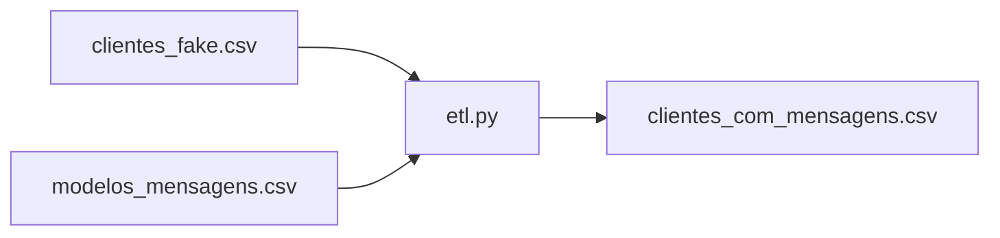

# TOTVS - Fundamentos de Engenharia de Dados e Machine Learning

Este repositório reúne projetos, relatórios e materiais desenvolvidos durante a formação **TOTVS - Fundamentos de Engenharia de Dados e Machine Learning**.

A proposta é organizar os desafios práticos em pastas separadas, mantendo um único repositório como portfólio de estudos e evolução durante a formação.

---

## Objetivo do repositório

O objetivo deste repositório é documentar projetos práticos relacionados a:

- Engenharia de Dados;
- Ciência de Dados;
- Machine Learning;
- Python;
- Pipeline ETL;
- Computação em Nuvem;
- AWS;
- Organização de projetos no GitHub;
- Documentação técnica com Markdown.

Cada desafio possui sua própria pasta, com arquivos, códigos, relatórios e referências específicas.

---

## Estrutura do repositório

```text
TOTVS - Fundamentos de Engenharia de Dados e Machine Learning/
│
├── README.md
├── AmbienteVirtual.md
├── totvs/
│
├── Desafio - Redução dos Custos em Farmácias com AWS/
│   ├── relatorio.md
│   └── database/
│       └── modelo-banco.sql
│
└── Desafio - Explorando IA Generativa em um Pipeline de ETL com Python/
    ├── README.md
    ├── etl.py
    ├── requirements.txt
    │
    ├── data/
    │   ├── clientes_fake.csv
    │   ├── modelos_mensagens.csv
    │   └── clientes_com_mensagens.csv
    │
    └── GeradorDadosFakes/
        ├── geradorDados.py
        └── exportar_modelos_mensagens.py
```

---

# Projetos

## 1. Desafio - Redução dos Custos em Farmácias com AWS

Projeto prático com foco em **computação em nuvem** utilizando serviços da AWS.

A proposta simula uma empresa farmacêutica fictícia, chamada **Abstergo Industries**, que deseja reduzir custos e modernizar sua infraestrutura utilizando cloud computing.

### Objetivo do desafio

Criar um relatório apresentando **3 serviços AWS** que poderiam ajudar a empresa a reduzir custos operacionais, melhorar a segurança e preparar sua infraestrutura para crescimento.

### Serviços AWS abordados

| Serviço | Finalidade |
|---|---|
| Amazon EC2 | Hospedagem de sistemas e aplicações |
| Amazon S3 | Armazenamento de arquivos e backups |
| Amazon RDS | Banco de dados gerenciado |

### Arquivos do projeto

- [`relatorio.md`](./Desafio%20-%20Redução%20dos%20Custos%20em%20Farmácias%20com%20AWS/relatorio.md)
- [`database/modelo-banco.sql`](./Desafio%20-%20Redução%20dos%20Custos%20em%20Farmácias%20com%20AWS/database/modelo-banco.sql)

### Referências importantes

- Amazon EC2: https://aws.amazon.com/pt/ec2/
- Documentação Amazon EC2: https://docs.aws.amazon.com/ec2/
- Amazon S3: https://aws.amazon.com/pt/s3/
- Documentação Amazon S3: https://docs.aws.amazon.com/s3/
- Amazon RDS: https://aws.amazon.com/pt/rds/
- Documentação Amazon RDS: https://docs.aws.amazon.com/rds/
- AWS Pricing Calculator: https://calculator.aws/
- GitHub Markdown: https://docs.github.com/pt/get-started/writing-on-github
- Mermaid no GitHub: https://docs.github.com/en/get-started/writing-on-github/working-with-advanced-formatting/creating-diagrams

---

## 2. Desafio - Explorando IA Generativa em um Pipeline de ETL com Python

Projeto prático com foco em **Ciência de Dados**, **Python** e **pipeline ETL**.

A proposta original do desafio utiliza uma API externa e IA generativa para criar mensagens personalizadas. Neste projeto, foi utilizada a alternativa com arquivos CSV, mantendo o foco no entendimento do fluxo ETL.

### Objetivo do desafio

Construir um pipeline ETL com Python, demonstrando as etapas de:

| Etapa | Significado | Aplicação no projeto |
|---|---|---|
| Extract | Extração | Leitura dos arquivos CSV |
| Transform | Transformação | Geração de mensagens personalizadas |
| Load | Carregamento | Salvamento do resultado em novo CSV |

### Fluxo do projeto



### Como funciona

O projeto lê uma base de clientes fictícios e uma base com modelos de mensagens. Em seguida, o script Python identifica o perfil de cada cliente e gera uma mensagem de marketing personalizada.

Ao final, o resultado é salvo em um novo arquivo CSV contendo os dados originais e a coluna `mensagem_marketing`.

### Arquivos do projeto

- [`README.md`](./Desafio%20-%20Explorando%20IA%20Generativa%20em%20um%20Pipeline%20de%20ETL%20com%20Python/README.md)
- [`etl.py`](./Desafio%20-%20Explorando%20IA%20Generativa%20em%20um%20Pipeline%20de%20ETL%20com%20Python/etl.py)
- [`requirements.txt`](./Desafio%20-%20Explorando%20IA%20Generativa%20em%20um%20Pipeline%20de%20ETL%20com%20Python/requirements.txt)
- [`data/clientes_fake.csv`](./Desafio%20-%20Explorando%20IA%20Generativa%20em%20um%20Pipeline%20de%20ETL%20com%20Python/data/clientes_fake.csv)
- [`data/modelos_mensagens.csv`](./Desafio%20-%20Explorando%20IA%20Generativa%20em%20um%20Pipeline%20de%20ETL%20com%20Python/data/modelos_mensagens.csv)
- [`data/clientes_com_mensagens.csv`](./Desafio%20-%20Explorando%20IA%20Generativa%20em%20um%20Pipeline%20de%20ETL%20com%20Python/data/clientes_com_mensagens.csv)
- [`GeradorDadosFakes/geradorDados.py`](./Desafio%20-%20Explorando%20IA%20Generativa%20em%20um%20Pipeline%20de%20ETL%20com%20Python/GeradorDadosFakes/geradorDados.py)
- [`GeradorDadosFakes/exportar_modelos_mensagens.py`](./Desafio%20-%20Explorando%20IA%20Generativa%20em%20um%20Pipeline%20de%20ETL%20com%20Python/GeradorDadosFakes/exportar_modelos_mensagens.py)

### Referências importantes

- Python `venv`: https://docs.python.org/3/library/venv.html
- Pandas `read_csv`: https://pandas.pydata.org/docs/reference/api/pandas.read_csv.html
- Pandas `to_csv`: https://pandas.pydata.org/docs/reference/api/pandas.DataFrame.to_csv.html
- Faker Python: https://faker.readthedocs.io/
- Git: https://git-scm.com/doc
- GitHub Markdown: https://docs.github.com/pt/get-started/writing-on-github
- Mermaid: https://mermaid.js.org/
- Mermaid no GitHub: https://docs.github.com/en/get-started/writing-on-github/working-with-advanced-formatting/creating-diagrams

---

# Ambiente virtual

O projeto utiliza ambiente virtual Python para organizar as dependências.

Arquivo de apoio:

- [`AmbienteVirtual.md`](./AmbienteVirtual.md)

Comando básico para criar ambiente virtual:

```bash
python3 -m venv totvs
```

Ativar ambiente virtual no Linux:

```bash
source totvs/bin/activate
```

Instalar dependências de um projeto:

```bash
pip install -r requirements.txt
```

---

# Como atualizar o GitHub

Após alterar arquivos ou adicionar novos projetos, use:

```bash
git status
```

Adicionar alterações:

```bash
git add .
```

Criar commit:

```bash
git commit -m "Atualiza projetos da formação TOTVS"
```

Enviar para o GitHub:

```bash
git push
```

---

# Boas práticas utilizadas

- Organização dos desafios por pastas;
- Uso de README geral na raiz do repositório;
- README específico dentro de cada desafio;
- Uso de arquivos CSV para simulação de dados;
- Uso de ambiente virtual Python;
- Separação entre dados, código e documentação;
- Comentários explicando o funcionamento dos scripts;
- Diagramas Mermaid para facilitar entendimento visual;
- Referências oficiais para estudo;
- Versionamento com Git e publicação no GitHub.

---

# Tecnologias abordadas

| Tecnologia | Uso |
|---|---|
| Python | Scripts e pipeline ETL |
| Pandas | Manipulação de dados em CSV |
| Faker | Geração de dados fictícios |
| CSV | Entrada e saída de dados |
| AWS | Computação em nuvem |
| Git | Versionamento |
| GitHub | Publicação do portfólio |
| Markdown | Documentação |
| Mermaid | Diagramas visuais |

---

# Autor

**Emanuel Cosmo**

Repositório desenvolvido durante a formação **TOTVS - Fundamentos de Engenharia de Dados e Machine Learning**.